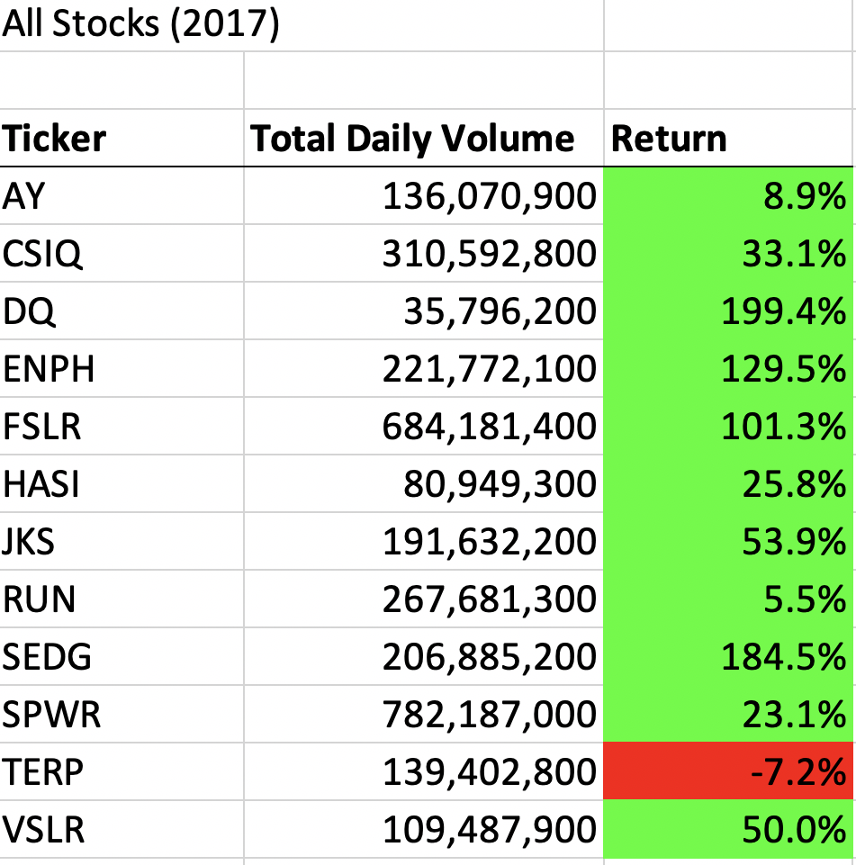
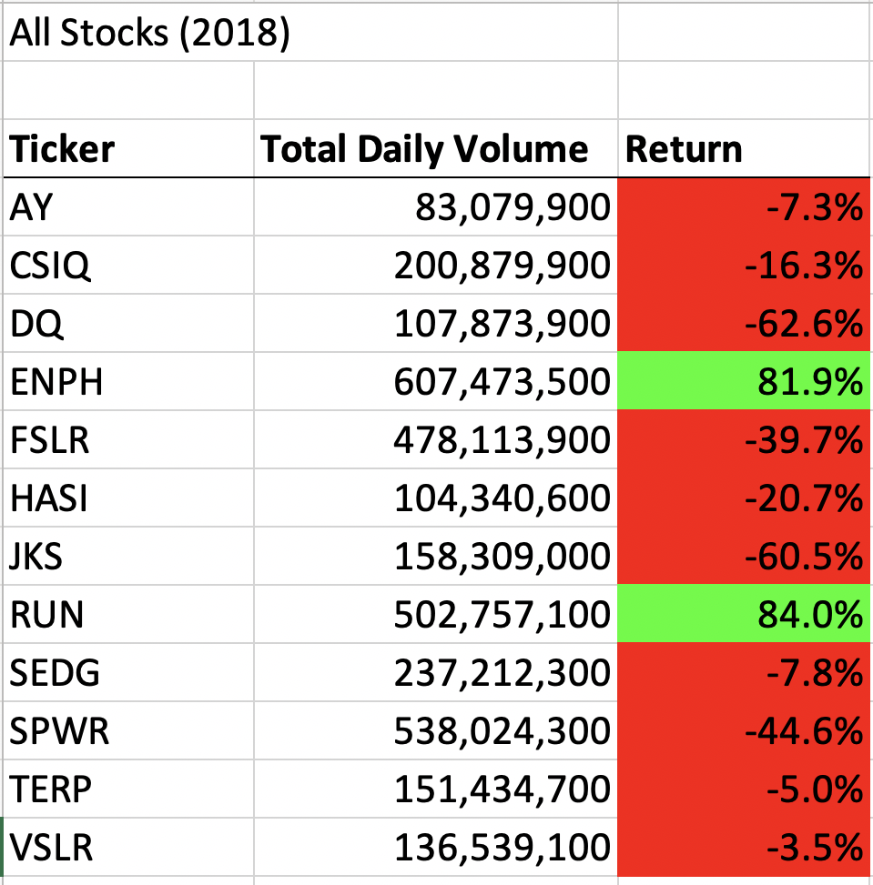

# stock-analysis
## Challenge
In this challenge we were asked to refactor the code that we had used for the exercises. While the initial code did work, it would not be ideal for larger data sets. The current data set is just above 3000 rows, so not that large. The new code would only loop through the data once. We created arrays for all the data points we were interested vs just an array for stocks.

running the VBA script produced the following results:

Running both scripts individually, it was hard to see any noticeable difference for the length to complete. I ran a timer to to measure the time it would take to run the program. The original took 3.2 seconds vs the factored one at 1.26seconds. If the data set was much larger, then this would have been a major difference.
